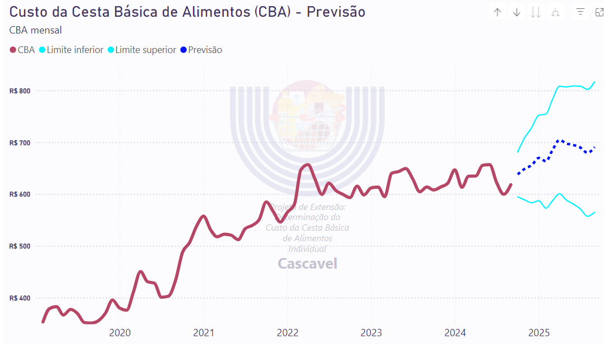

## Previsão dos Preços da Cesta Básica de Alimentos (CBA) de Cascavel-PR Para 12 Meses

Os valores da Cesta Básica de Alimentos (CBA) são calculados pelo Projeto de Extensão do curso de Economia da Unioeste, utilizando dados coletados pela equipe do projeto com base na metodologia do DIEESE.

O objetivo desta pesquisa é prever os valores da CBA para os 12 meses subsequentes à publicação mensal dos boletins, disponibilizando essas previsões no site da Universidade. Esse processo visa ancorar as expectativas dos agentes econômicos, além de fomentar a interação e fornecer informações úteis para trabalhos acadêmicos.

[Clique aqui para acessar o resultado final da visualização.](https://www.unioeste.br/portal/determinacao-do-custo-da-cesta-basica-de-alimentos/inicio)

## Metodologia
Foi utilizado técnica SARIMA (Seasonal Autoregressive Integrated Moving Average) que é uma extensão do modelo ARIMA, projetada para lidar com dados que apresentam padrões sazonais. A metodologia SARIMA incorpora três componentes principais: autorregressivo (AR), integração (I), e média móvel (MA), além de ajustes específicos para a sazonalidade dos dados, considerando repetições periódicas ao longo do tempo.

No modelo SARIMA, além dos parâmetros comuns do ARIMA (p, d, q), são incluídos componentes sazonais (P, D, Q) e o período da sazonalidade (S). Isso permite capturar padrões que se repetem em ciclos, como a variação dos preços da cesta básica de alimentos em diferentes épocas do ano. SARIMA é amplamente utilizado em previsões de séries temporais com sazonalidade, proporcionando uma abordagem robusta para previsões de longo prazo, como a projeção de 12 meses.

## Continuação de Estudo
O próximo objetivo é replicar o estudo, com as devidas adaptações, utilizando as bases de dados dos projetos da CBA nos campi de Toledo-PR e Francisco Beltrão-PR. Isso permitirá a criação de visualizações em BI, tanto para as séries temporais da CBA e dos alimentos individuais, quanto para as previsões de 12 meses, destacando as particularidades da região Oeste do Paraná.

